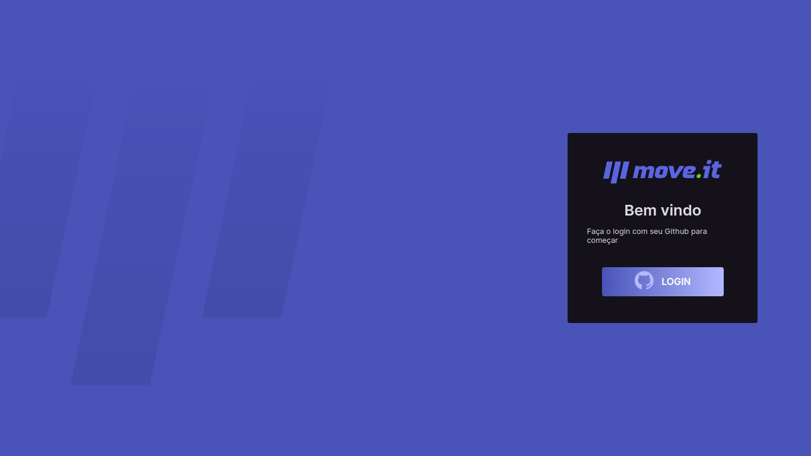
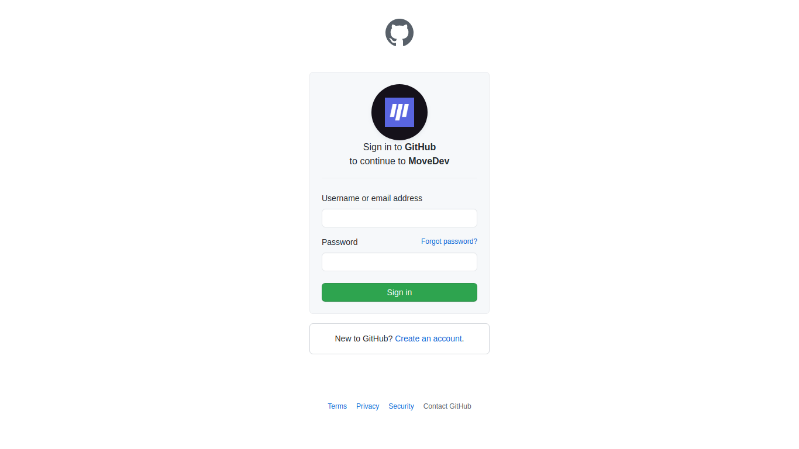
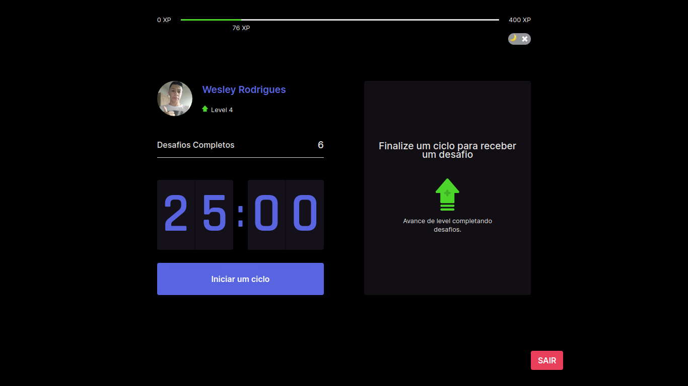

<h1 align="center"> <strong>🏋️MoveDev</strong></h1>

<p align="center">


</p>

<br />
<p align="center"></p>
<p align="center"></p>
<p align="center"></p>
<p align="center"></p>


<br />

# 📕 About
 MoveDev is a project to help people to make more exercises.
</br>

# 🛠️Technologies 

This project was made using the follow technologies:

- [TypeScript](https://www.typescriptlang.org/)
- [React](https://reactjs.org)
- [NextJS](https://nextjs.org/)
- [NextAuth](https://next-auth.js.org/)
- [VS Code](https://code.visualstudio.com/)


# 🚀Features


* Screen in notification at the end countdown.
* Experience Bar.
* Dark mode.
* login from github.


# 🏃Getting Started
```sh
#  Clone Repository
$ git clone  https://github.com/wesleywcr/MoveDev.git
```
```sh
# Install Dependencies
$ yarn install
# Start application
$ yarn dev
```

# 🤝 Contributing

- Fork this repository
- Create a branch with your feature: `git checkout -b my-feature`
- Commit your changes: `git commit -m 'feat: My new feature'`
- Push your branch: `git push origin my-feature`

# 📝License

Released in 2021.
This project is under the [MIT license](./LICENSE)
Made with ❤️ by [Wesley Rodrigues](https://github.com/wesleywcr)🤙👊
